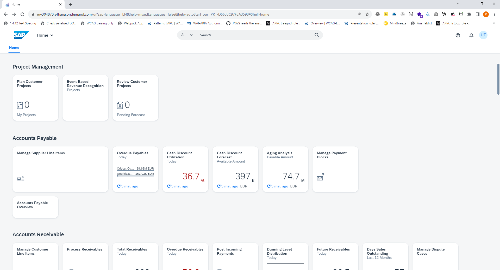
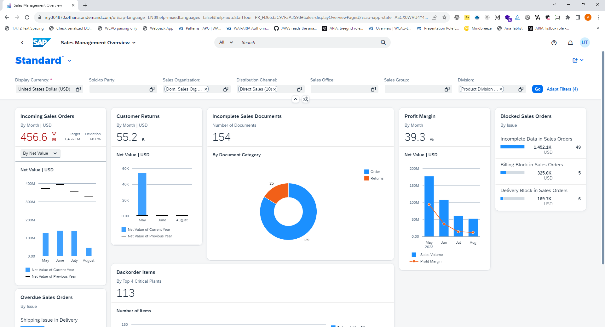

# Rolle `dashboard`

## Einleitung

Das Dashboard ist ein Container, der immer häufiger verwendet wird.

Ein Dashboard ist eine grafische Darstellung von Informationen, Daten oder Leistungsindikatoren, die in kompakter Form auf einer einzigen Bildschirmseite präsentiert werden. Es bietet einen prägnanten und leicht verständlichen Überblick über verschiedene Aspekte eines Geschäftsprozesses, einer Website, einer Anwendung oder eines anderen Systems. Dashboards dienen oft auch als Einstiegspunkt zu den verschiedenen Bereichen einer Webanwendung.

Layoutmässig nehmen Dashboards  Dashboards normalerweise das gesamte Anwendungsfenster ein, nutzen aber oft auch nur den Hauptbereich oder sogar nur einen Teil davon. Widgets innerhalb von Dashboards können häufig vom Benutzer gruppiert, in der Größe angepasst und neu angeordnet werden. Da es bisher keine semantische Kennzeichnung für den Dashboard-Bereich gibt, ist es besonders für Bildschirmlesegerät-Nutzer und für Benutzer von Vergrößerungssoftware sehr schwierig, ein Dashboard als solches zu identifizieren.

Ausserdem handelt es sich bei Dashboards um solche Bereiche, die Matt King in seinem Vorschlag [An Accessibility Opportunity Hidden in Modeless Web Dialogs]( https://gist.github.com/mcking65/11882ebbe2889964c62ab5a16ab528c3) als 
"similar to modeless dialogs" bezeichnet. 

## Beispiele

Hier ist ein Beispiel für das HOM-Dashboard von SAP's S/4HANA:

In diesem Dashboard können Kacheln vom Benutzer gruppiert, neu angeordnet und in der Größe angepasst werden.

Ein weiteres Beispiel für ein Dashboard ist das Verkaufsübersichts-Dashboard von SAP's S/4HANA:

Hier können Kacheln frei vom Benutzer neu angeordnet und angepasst werden, aber nicht gruppiert werden.

Ein letztes Beispiel für ein Dashboard ist das Homde Dashboard der Fabasoft Cloud:

In diesem Dashboard können Kacheln vom Benutzer basierend auf einem Rasterlayout neu angeordnet und angepasst werden, aber nicht gruppiert.

## ARIA Semantics

- Rolle `dashboard`
- Abgeleitet von der Rolle `dialog`
- `aria-modal=false` (default)
- `aria-orientation=both` (default)
- Allowed Accessibility Child Roles:
   - `group`
   - `heading`
   - `tile`
# Rolle ` | Kachel`

## Beschreibung

Die Rolle `tile` ist das Accessibility Child der `dashboard`-Rolle. Die Elemente mit dieser Rolle sind ähnlich den Elementen mit der Rolle `cell`, indem sie tabellenzellenartige, sowohl horizontal als auch vertikal nebeneinander positioniert werden. Wie Tabellenzellen können Sie aber von unterschiedlicher Größe sein. Die `tile`-Rolle verhält sich somit wie ein `TD`-Element, das unterschiedliche Werte der `colspan` und/oder `rowspan` Attribute hat. Dieser Vergleich soll nur zum besseren Verständnis des Konzepts behilflich sein und bedeutet keineswegs, dass die Kacheln im Markup dem Tabellenparadigma immer folgen müssen.

## ARIA-Semantik
- Role name: `tile` or `card`
- Similar concept: table cell (`cell` element)
- Required Accessibility Parent Roles: 
   - `dashboard`
   - `group`

# Tastaturbedienung

Dieser Exkurs gehört mehr zum ARIA Authoring Practices Guide, ist aber von Nutzen, wenn man gleich über die Belange der Tastaturbedienung für eine Rolle nachdenkt.

Einige der Dashboards erlauben die Navigation zwischen den Widgets mit den Pfeiltasten oder der Tabulatortaste. Ganz wenige erlauben das Ändern der Größe und Position mit der Tastatur. Die meisten Dashboards sehen aber keine eigene Navigation mit der Tastatur zwischen den Widgets vor.

Alle Funktionalitäten, die mit der Maus möglich sind, stehen auch per Tastatur zur Verfügung:

- Navigation zwischen den einzelnen Kacheln

- Verändern der  Kachel-Reihenfolge

- Anpassen der  Kachel-Größe.

Hier ist ein Vorschlag für Tastenkombinationen:

| Tastenkombination | Funktion |
|------------------|------------------|
| F6 / Umschalt+F6 | Verlassen des Dashboards |
| Pfeiltasten | Navigieren zwischen den  Kacheln (in visueller Anordnung). Der Fokus wird jeweils auf den ersten Widget in einer  Kachel gesetzt. |
| Strg + Pfeil rechts | Zur nächsten Kachel in der kompletten  Kachel-Reihenfolge |
| Strg+Pfeil links | Zur vorherigen Kachel in der kompletten Kachel-Reihenfolge |
| Tab und Umschalt+Tab | Zum nächsten/vorherigen Widget (durch alle Kacheln) |

Alle Funktionalitäten einer Kachel, die mit der Maus möglich sind, müssen auch per Tastatur zur Verfügung gestellt werden. Um die Größe und/oder die Position einer Kachel im Dashboard mit der Tastatur anzupassen, gibt es zwei Alternativen:

1. Ein Menübutton in der Kachel öffnet ein Menü mit entsprechenden Optionen dafür oder
2. Umschalt+F10 / Kontextmenütaste öffnet ein Kontextmenü mit geeigneten Optionen, wenn sich der Fokus auf einem Widget in einer Kachel befindet.
