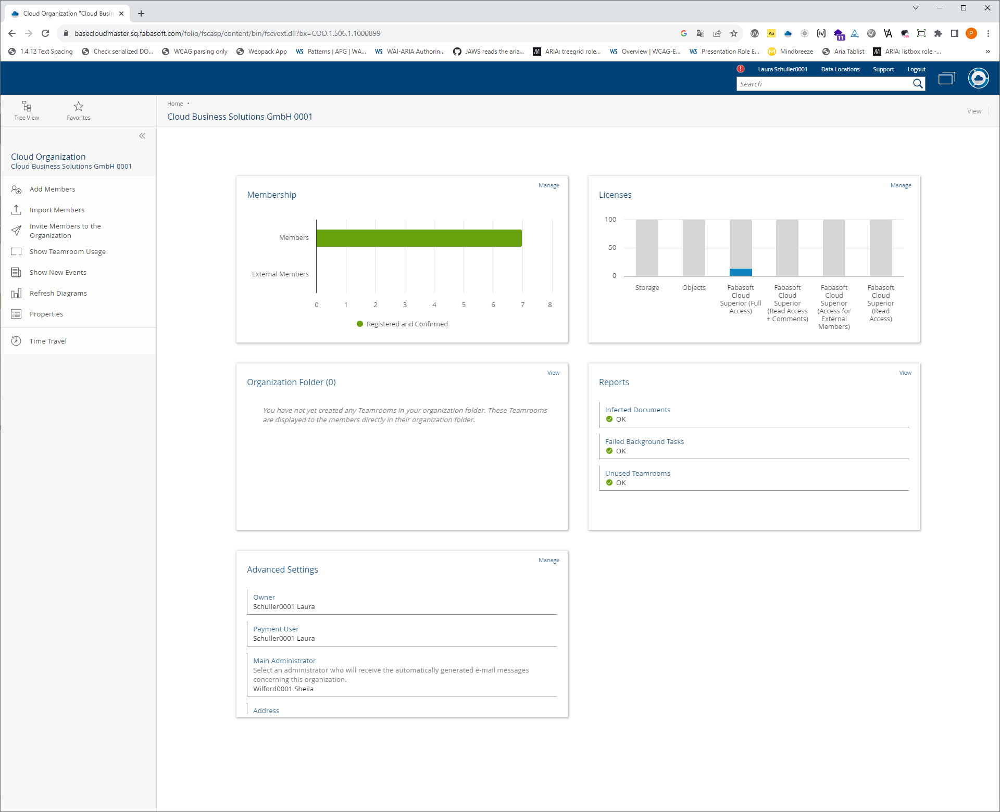

# Rolle `dashboard` benötigt

## Einleitung

Das Dashboard ist ein Container, der immer mehr in Verwendung ist.

Ein Dashboard ist eine grafische Darstellung von Informationen, Daten oder Leistungsindikatoren, die in kompakter Form auf einer einzigen Bildschirmseite angezeigt werden. Es bietet einen übersichtlichen und leicht verständlichen Überblick über verschiedene Aspekte eines Geschäftsprozesses, einer Website, einer Anwendung oder eines anderen Systems. Sie dienen ebenfalls oft als Einstieg zu den einzelnen Bereichen einer Webanwendung.

Layoutmässig nehmen Dashboards entweder ein ganzes Anwendungsfenster ein, oft aber auch nur den Hauptbereich rechts oder gar nur ein Teil des Anwendungsfensters. Da es bislang keine semantische Auszeichnung für den Dashboardbereich gibt, ist es besonders für die Screenreaderbenutzer und für die Benutzer der Vergrößerungssoftware sehr schwierig festzustellen, dass sich dabei um ein Dashboard handelt und wo sein Anfang und Ende sind.

Ausserdem handelt es sich bei Dashboards um solche Bereiche, die Matt King in seinem Vorschlag [An Accessibility Opportunity Hidden in Modeless Web Dialogs]( https://gist.github.com/mcking65/11882ebbe2889964c62ab5a16ab528c3) als 
> similar to modeless dialogs 

bezeichnet. 

Fabasoft Cloud verwendet z. B. ein Dashboard als das Zugangsfenster zu allen Cloudinhalten - Cloud Home:

oder als Zugang zu einer der Web Apps auf der Fabasoft Cloud Platform:

## ARIA Semantics

- Rolle `dashboard`
- Abgeleitet von der Rolle `dialog`
- `aria-modal=false` (default)
- `aria-orientation=both` (default)
- Allowed Accessibility Children: 
  - `heading` 
  - `tile`

# Rolle `tile`

## Beschreibung

Die Rolle `tile` ist das Accessibility Child der `dashboard`-Rolle. Die Elemente mit dieser Rolle sind ähnlich den Elementen mit der Rolle `cell`, indem sie tabellenzellenartige, sowohl horizontal als auch vertikal nebeneinander positioniert werden. Im Gegensatz zu Tabellenzellen können Sie aber von unterschiedlicher Größe sein. Die `Tiles` verhalten sich somit wie `td`-Elemente, die unterschiedliche Werte der `colspan` und/oder `rowspan` Attribute haben. Dieser Vergleich soll nur zum besseren Verständnis des Konzepts behilflich sein und bedeutet keineswegs, dass die Tiles im Markup dem Tabellenparadigma immer folgen.

## ARIA-Semantik
- Ähnlicher Konzept: Tabellenzelle (`cell`-Element)
- Accessibility Parent: `dashboard`
