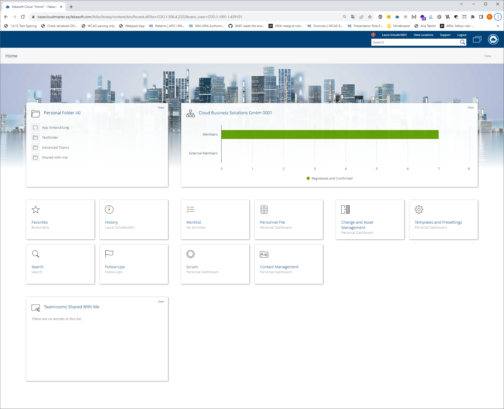
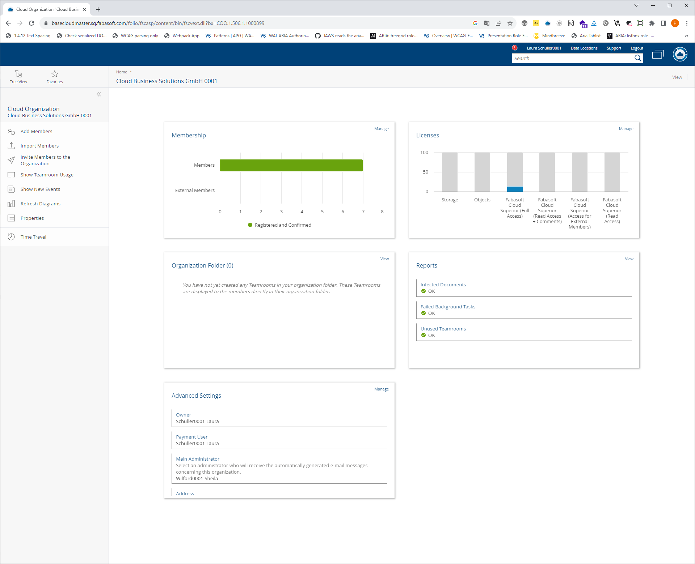

# `dashboard` Fole

## Introduction

The dashboard is a container that is being used more and more.

A dashboard is a graphical representation of information, data, or performance indicators presented in a compact form on a single screen. It provides a concise and easy-to-understand overview of various aspects of a business process, website, application or other system. Dashbboards also often serve as an entry point to the individual areas of a web application.

In terms of layout, dashboards either take up an entire application window, or only the main area on the right side or even just part of the application window. Since there is no semantic markup for the dashboard area up to now, it is very difficult, especially for the screen reader users and for the users of the magnifier software, to determine that this is a dashboard and where its beginning and end are.

In addition, dashboards are areas that Matt King describes in his proposal [An Accessibility Opportunity Hidden in Modeless Web Dialogs]( https://gist.github.com/mcking65/11882ebbe2889964c62ab5a16ab528c3) as
> similar to modeless dialogs

Fabasoft Cloud uses e.g. a dashboard as the access window to all cloud contents - Cloud Home:

or as access to one of the web apps on the Fabasoft Cloud Platform:

## ARIA semantics

- Role `dashboard`
- Derived from the role `dialog` 
- `aria-modal=false` (default)
- `aria-orientation=both` (default)
- Allowed Accessibility Children:
   - `heading`
   - `tile`

# Roll `tile`

## Description

The `tile` role is the accessibility child of the `dashboard` role. The elements with this role are similar to the elements with the `cell` role in that they are placed next to each other in a table cell-like manner, both horizontally and vertically. Like table cells they can be of different sizes. The `Tiles` thus behave like `td` elements that have different values of the `colspan` and/or `rowspan` attributes. This comparison is only intended to help to better understand the concept and does not mean that the tiles in the markup always follow the table paradigm.

## ARIA semantics
- Similar concept: table cell (`cell` element)
- Accessibility Parent: `dashboard`